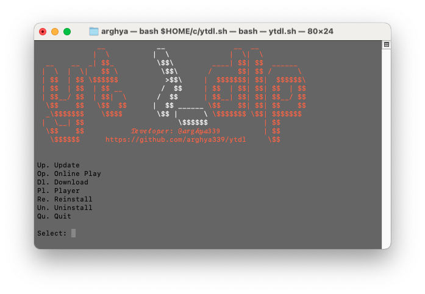
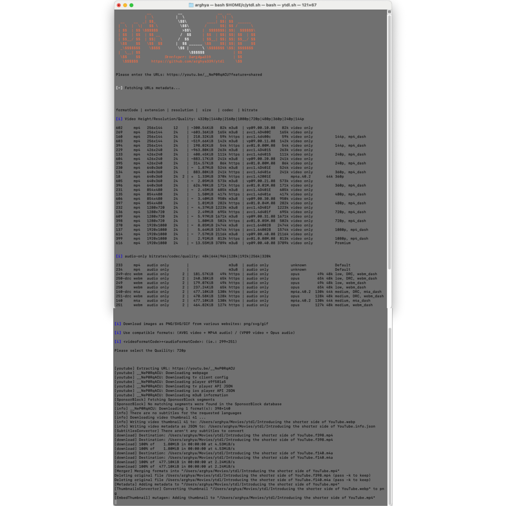

<h1 align="center">yt >_dl</h1>
<p align="center">
A feature-rich command-line Video/Audio Downloader for macOS, based on yt-dlp.
<br>
<br>

<br>

## Purpose
- This script automates the process of downloading video/audio using [yt-dlp](https://github.com/yt-dlp/yt-dlp).

## Feature
- based on [yt-dlp](https://github.com/yt-dlp/yt-dlp) that support downloading video/audio from [1,500+ of website](https://github.com/yt-dlp/yt-dlp/blob/master/supportedsites.md)
- written in bash shell script
- Aria2 as downloader for high quality video instedad of default (curl)
- SponsorBlock Filtering for audio source
- Embed Metadata to audio file
- Thumbnail as covert art
- Crop Thumbnail into square for YT audio downloads
- Playlist Name as Album Metadata if data is not present
- Custom Audio/Video Quality
- MP3 as Audio Format
- Save Subtitles into .vtt or .srt file
- Mark YT sponsorblock segments as chapters for video
- Download SD Video Format in MP4 and HD /FULL HD /HQ Video in MKV for Smaller file Sized
- Preferred Video Codec VP09 for HQ video and AV01 Codec for FULL HD/ HD /SD video
- Support up to highest quality such as [8K](https://www.youtube.com/watch?v=G5RpJwCJDqc&list=PLl-EaOsRdw0-lSwCyMRSUlSDmrxaprRYE)
- Download images as PNG/JPG/SVG/GIF from various websites (cloudflare unprotect site only), tested on YT and YT Music.
- Built in Updating feature
- User Friendly and FOSS
- Smaller size script (40 KB), allowing you to save space on your macOS

## Prerequisites
- macOS computer with working internet connection.

## Usage
- Open macOS Terminal and run the script with the following command:
```
curl -o "$HOME/.ytdl.sh" "https://raw.githubusercontent.com/arghya339/ytdl/refs/heads/main/ytdl.sh" && bash "$HOME/.ytdl.sh"
```
Run ytdl with these commands in Terminal:
```
ytdl
```

> This script was tested on an Intel Mac running macOS Sonoma (14) with Terminal v2.14(453) with bash v3.2.57.

<details><summary>
Alternative
</summary>

Android:

[Seal](https://github.com/JunkFood02/Seal)

[ytdlnis](https://github.com/deniscerri/ytdlnis)

macOS:

[MacYTDL](https://github.com/section83/MacYTDL/releases) formatSlectionNotAvailable

[yt-dlp-gui](https://github.com/dsymbol/yt-dlp-gui) qualitySelectionNotAvailable

[youtube-dl-gui](https://github.com/jely2002/youtube-dl-gui) notWorkOnMac

[ezytdl](https://github.com/sylviiu/ezytdl) notWorkOnMac

Windows:

[yt-dlp-gui](https://github.com/dsymbol/yt-dlp-gui)

Linux:

[yt-dlp-gui](https://github.com/dsymbol/yt-dlp-gui)
</details>

## Dependencies
["bash"](https://www.gnu.org/software/bash/) [[GNU 3.0]](https://www.gnu.org/licenses/gpl-3.0.html), ["brew"](https://github.com/Homebrew/brew) [[BSD 2.0]](https://github.com/Homebrew/brew/blob/master/LICENSE.txt), ["Python"](https://www.python.org/downloads/) [PSF / GPL], ["yt-dlp"](https://github.com/yt-dlp/yt-dlp) [[GNU 3.0]](https://github.com/yt-dlp/yt-dlp/blob/master/LICENSE), ["ffmpeg"](https://ffmpeg.org/) [[GPL 2.0]](https://github.com/Homebrew/homebrew-core/blob/2ad483ba44590da050eb681eb052e63d042b7340/Formula/f/ffmpeg@5.rb), ["imagemagick"](https://imagemagick.org/) [[Apache 2.0]](https://github.com/ImageMagick/ImageMagick/blob/main/LICENSE), ["Aria2"](https://aria2.github.io/) [[GPL 2.0]](https://aria2.github.io/), ["jq"](https://github.com/jqlang/jq) [[MIT]](https://github.com/jqlang/jq/blob/master/COPYING)

["VLC"](https://www.videolan.org/vlc/) [GPL 2.0], ["Aural Player"](https://github.com/kartik-venugopal/aural-player) [[MIT]](https://github.com/kartik-venugopal/aural-player/blob/main/LICENSE)

["FreeTube"](https://github.com/FreeTubeApp/FreeTube) [[GNU 3.0]](https://github.com/FreeTubeApp/FreeTube/blob/development/LICENSE), ["YT Music"](https://github.com/th-ch/youtube-music) [[MIT]](https://github.com/th-ch/youtube-music/blob/master/license)

## How it works (_[Demo on YouTube](https://youtube.com/)_)



## Devoloper info
- Powered by [yt-dlp](https://github.com/yt-dlp/yt-dlp)
- Developer: [@arghya339](https://github.com/arghya339)